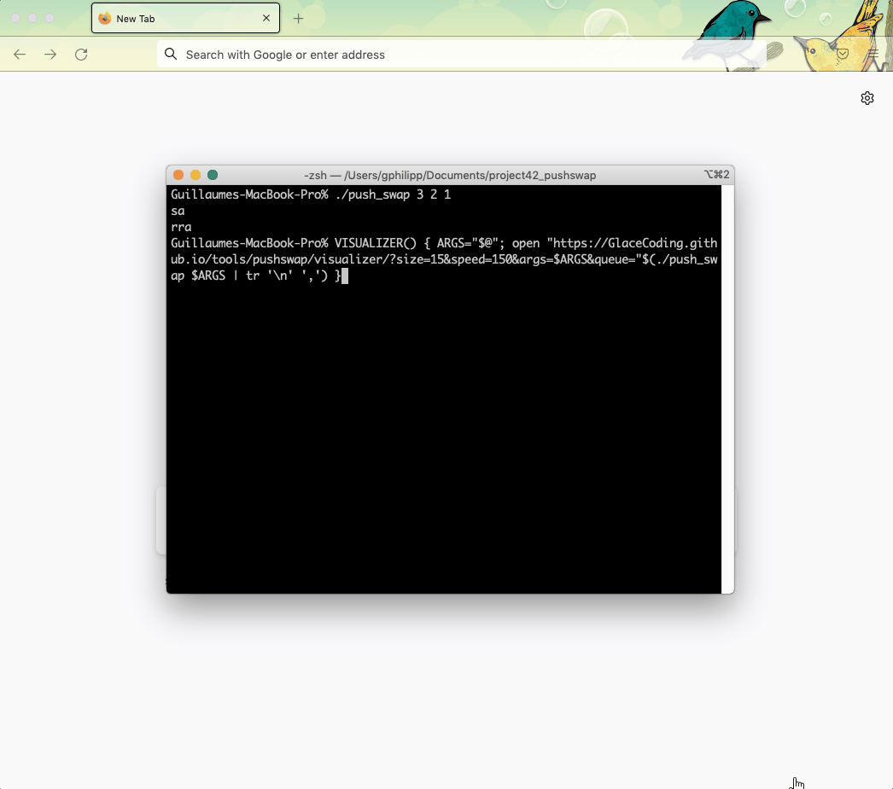

# GlaceCoding website

## Tools

### Push_swap
 - Browser visualizer for pushswap project of 42School, a sh script has been made to run your pushswap and then open a webpage, [this tool is available here](https://glacecoding.github.io/tools/pushswap/visualizer/?size=15&speed=150&args=71%20108%2097%2099%20101%2067%20111%20100%20105%20110%20103&queue=pb,pb,pb,pb,pb,pb,pb,pb,rra,pa,pa,ra,pa,ra,ra,pa,rra,pa,pa,rb,pa,rra,rra,rra,pa,ra,ra,ra,).
   